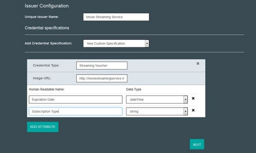
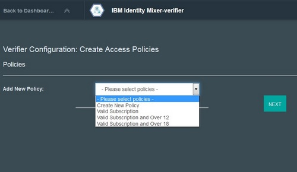
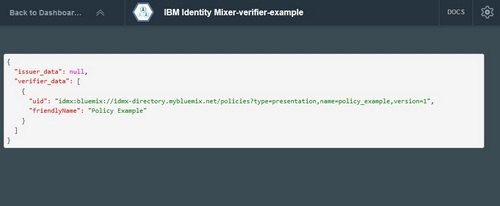

---

copyright:
  years: 2015, 2016
lastupdated: "2016-04-18"
---

{:shortdesc: .shortdesc}
{:new_window: target="_blank"}
{:codeblock: .codeblock}

# Getting started with Identity Mixer (Experimental)

IBM Identity Mixer for Bluemix is a protocol suite for privacy-preserving authentication and transfer of certified attributes.
It allows for user authentication without collecting any personal data. Thus, there is no personal data that needs to be protected, managed, and treated according to complex legal regulations.
Nevertheless, service providers can rest assured that their access restrictions are fully satisfied.

An Identity Mixer authentication system comprises users, issuers, and verifiers (see the Figure below).
An issuer certifies a user's attributes in the form of a digital certificate, hereafter called *credential*.
A user stores her credentials in a *credential wallet* application (a web-based or mobile app).
To authenticate a user, a service provider sends her a *presentation policy* that describes which credentials the user should present to
obtain access.
The user lets her credential wallet derive a corresponding *presentation token* from her credentials and sends it to the service provider.
The service provider, acting as verifier, then verifies whether the token is valid with respect to the originally sent policy.
Considering this procedure, the Identity Mixer Bluemix service allows entities to take on the roles of an issuer or a verifier.

Currently the Identity Mixer Service is running as experimental and works with Node.js™ applications. 
This constraint is mainly due to the [credential wallet sample application](https://idmx-wallet.mybluemix.net/) that is used together with the service. 
A credential wallet account is required to use both issuance and verification services. 
While the service is experimental we ask users to NOT store any personal data in the sample credential wallet.
Since the core service offers REST API, other runtimes will be also supported when migrating to Beta and GA. 
The credential wallet will be released as a mobile application in the beginning of 2016.

Please refer to the [Node.js™ documentation](https://www.ng.bluemix.net/docs/starters/nodejs/index.html) for the information on how to create an application in your Bluemix space.  
We provide the source code of the three sample Node.js™ applications: [Sample Issuer](https://hub.jazz.net/project/idemix/issuer/overview), 
[Sample Verifier](https://hub.jazz.net/project/idemix/verifier/overview), and
[Sample Issuer and Verifier](https://hub.jazz.net/project/idemix/issuer-verifier/overview). 
They are intended to help you copy the files into your own projects
and assist you to deploy your own Identity Mixer applications to your own IBM Bluemix space.
You can find the detailed instructions in the Readme.md file for every project.

If you have any questions, please contact us at idemix@zurich.ibm.com.

## Adding the IBM Identity Mixer service to your Node.js™ application.

1. Login to IBM Bluemix.
1. Click Use Services or APIs.
1. Go to the Bluemix Labs catalog (you have to scroll down to the bottom of the Bluemix catalog).
1. Click "IBM Identity Mixer" from within the "Security" section of the BluemixLabs catalog:      

1. Configure the Identity Mixer service in the "Add Service" section of the page:    

  1. Select your Node.js™ application to bind the service to.
  1. Provide a suitable unique name for your Identity Mixer service if you prefer something another than the one suggested for you.
  1. The service is provided for free, so there is no plan to select.
  1. Having ensured the TERMS are acceptable to you, click CREATE.
1. Click OK if Bluemix requests to restart your application.

## Acting as Issuer
Step-by-step instructions on how to act as issuer:
1. From the IBM Bluemix Dashboard, locate and click your Bluemix Node.js™application to which you bound the Identity Mixer service.
1. Within the Services section of the your application, click its Identity Mixer issuer service. The Identity Mixer Setup Console will be loaded:              

1. Choose the ISSUER role and press START SETUP.
1. Choose a unique name for the Issuer (it must be unique within Bluemix not only your organization since it will be visible to the other applications that use Identity Mixer service):          

1. Add *Credential specification(s)* (a list of the attributes that are contained in a credential) that will be issued by your application by selecting one of the options below:
  1. Select one of the existing specifications that are non-editable:          
          

  1. OR Craft your own credential specification:         

      * Choose a unique name of the Credential Specification
      * Specify a link to the image that will be an icon displayed in the user's credential wallet. You can also use the default image.
      * Add Attributes to you specification by clicking ADD ATTRIBUTE, specifying a Human Readable Name and choosing an appropriate Data Type for each attribute.
1. When you are done, press NEXT.
1. After the Issuer keys are generated (this might take up to 2-3 min because of the key length,but this is only done once) a JSON file with all configuration Information will be displayed:          
         
PLEASE NOTE: This service is only available as experimental to demonstrate the technology. Please DO NOT use any real (personal) data with our service. 
All credential spesifications and issuer parameters (only the public key) are visible to the other applications that use Identity Mixer Experimental Service.
1. You can always see this file when selecting the service from the dashboard. You can copy this file into the sample applications (see the links to the projects above) or use the information by calling the service APIs directly.

## Acting as Verifier
Preparation: make sure that the access control is in place, i.e. each resource is assigned an access policy. 

Step-by-step instructions on how to act as Verifier:

1. From the IBM Bluemix Dashboard, locate and click your Bluemix Node.js™ application to which you bound the Identity Mixer service.
1. Within the Services section of the your application, click its Identity Mixer service. The Identity Mixer Setup Console will be loaded:             

1. Choose the VERIFIER role and press START SETUP.
3. Define *presentation policy* (description of what a user has to prove/reveal in order to be granted access to a resource). You can choose more than one policy: 
 1. Select one of the existing policies that are non-editable:          
          

  1. OR Craft your own credential presentation policy by choosing "Create New Policy":         

      * Specify a unique human-readable name of the policy.
      * Define predicates by clicking ADD PREDICATE, choosing the credential issuer, credential type, attribute, operator, and defining a constant:          

1. When you are done, press NEXT.
1. After the presentation policies are generated a JSON file with the information about the policies will be displayed:          
        
PLEASE NOTE: This service is only available as experimental to demonstrate the technology. Please DO NOT use any real personal data with our service. 
All presentation policies are visible to the other applications that use Identity Mixer Experimental Service.
1. You can always see this file when selecting the service from the dashboard. You can copy this file into the sample applications (see the links to the projects above) or use this information by calling the service APIs directly.

># Related Links {:class="linklist"}
>## API Reference {:id="api"}
>* [REST API for Identity Mixer](https://idmx-service-media.mybluemix.net/docs/)
>
># Related Links {:class="linklist"}
>## Compatible Runtimes {:id="buildpacks"}
>* [SDK for Node.js™](../../starters/nodejs/index.html#nodejs)
>
># Related Links {:class="linklist"}
>## Related Links {:id="general"}
>* [Identity Mixer: What it does](http://www.zurich.ibm.com/idemix/whatitdoes.html)
>* [Identity Mixer Demo](https://idemixdemo.mybluemix.net/)
>* [Identity Mixer Details](http://www.zurich.ibm.com/idemix/)
>
>{:elementKind="article" id="rellinks"}
