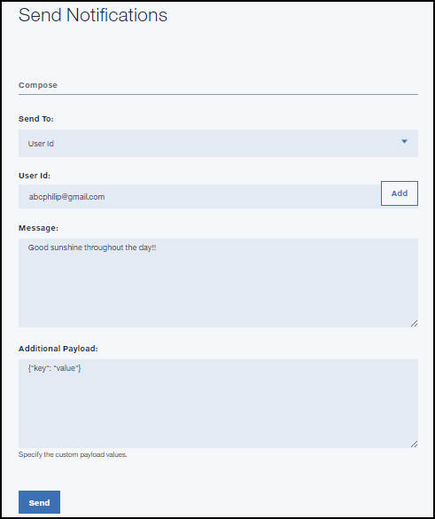

---

copyright:
 years: 2015, 2017

---

{:new_window: target="_blank"}
{:shortdesc: .shortdesc}
{:screen:.screen}
{:codeblock:.codeblock}

# Ativando notificações baseadas no usuário
{: #user_based_notifications}
Última atualização: 28 de fevereiro de 2017
{: .last-updated}

{{site.data.keyword.mobilepushshort}} baseado no ID do usuário destina-se a usuários do app móvel com mensagens customizadas. Com
notificações baseadas no usuário, é possível escolher notificar indivíduos
específicos com base em suas preferências.

## Registrar dispositivo com ID do usuário
{: #register_device_wh_userid}

Para ativar notificações push destinadas por ID do usuário, assegure-se de registrar
o dispositivo com um campo ID do usuário configurado.     

O ID do usuário pode ser qualquer sequência que o aplicativo forneça para o API de registro de dispositivo. Normalmente, um aplicativo móvel primeiro executará um ciclo de autenticação no qual o usuário do app móvel é autenticado junto a um serviço de autenticação, tal como o [{{site.data.keyword.amafull}} ](https://console.ng.bluemix.net/docs/services/mobileaccess/index.html){: new_window}. Na autenticação bem-sucedida, o ID de usuário autenticado então é passado para a API de
registro de dispositivo push. 

Para registrar-se para notificação baseada em userId, conclua as etapas a seguir:

### Android
{: #android-register}

Inicialize a classe MFPPush com a chave `AppGUID` e `clientSecret` do serviço {{site.data.keyword.mobilepushshort}}.
```
// Initialize the Push Notifications service
push = MFPPush.getInstance();
push.initialize(getApplicationContext(),"AppGUID", "clientSecret");
```
	{: codeblock}


- **AppGUID**: esta é a chave AppGUID do serviço
{{site.data.keyword.mobilepushshort}}.
- **clientSecret**: esta é a chave clientSecret do serviço
{{site.data.keyword.mobilepushshort}}.

  Use a API **registerDeviceWithUserId** para registrar o dispositivo para {{site.data.keyword.mobilepushshort}}.

```
// Register the device to Push Notifications
push.registerDeviceWithUserId("userId",new MFPPushResponseListener<String>() {
		@Override
		public void onSuccess(String response) {
		Log.d("Device is registered with Push Service.");}
		@Override
    public void onFailure(MFPPushException ex) {
		  Log.d("Error registering with Push Service...\n"
        + "Push notifications will not be received.");
		}
		});
```
	{: codeblock}

- **userId**: transmita o valor exclusivo de userId para registrar-se no {{site.data.keyword.mobilepushshort}}.

**Nota:** para ativar
{{site.data.keyword.mobilepushshort}} destinado por UserId, assegure-se de
registrar o dispositivo com um userId e também de passar o 'clientSecret'
que é alocado quando os serviços {{site.data.keyword.mobilepushshort}} são
provisionados. O registro do dispositivo falhará sem um clientSecret válido.

### Cordova
{: #cordova_register}

Use as APIs a seguir para registrar para {{site.data.keyword.mobilepushshort}} baseadas em UserId.

```
// Register device for Push Notification with UserId
var options = {"userId": "Your User Id value"};
BMSPush.registerDevice(options,success, failure); 
```
	{: codeblock}


- **userId**: transmita o valor exclusivo de userId para registrar-se no {{site.data.keyword.mobilepushshort}}.


### Swift
{: #swift-register}

```
// Initialize the BMSPushClient
let push =  BMSPushClient.sharedInstance
push.initializeWithAppGUID("appGUID", clientSecret:"clientSecret")
```
	{: codeblock}


- **AppGUID**: esta é a chave AppGUID do serviço
{{site.data.keyword.mobilepushshort}}.
- **clientSecret**: esta é a chave clientSecret do serviço
{{site.data.keyword.mobilepushshort}}.

Use a API **registerWithUserId** para registrar o dispositivo para {{site.data.keyword.mobilepushshort}}.

```
// Register the device to Push Notifications service
push.registerWithDeviceToken("deviceToken", WithUserId: "userId")  { (response, statusCode, error) -> Void in
if error.isEmpty {
  print( "Response during device registration : \(response)")
        print( "status code during device registration : \(statusCode)")
    } else {
  print( "Error during device registration \(error) ")
    }
  }
```
	{: codeblock}

- **userId**: transmita o valor exclusivo de userId para registrar-se no {{site.data.keyword.mobilepushshort}}.

### Google Chrome, Safari e Mozilla Firefox
{: #web-register}

Use as APIs a seguir para registrar-se para notificações baseadas em userId. Inicialize
o SDK com `app GUID`, `app Region` e
`Client Secret`.

```
var bmsPush = new BMSPush();
var params = {
    "appGUID":"push app GUID",
    "appRegion":"App Region",
    "clientSecret":"Push Client Secret" 
    }
  bmsPush.initialize(params, function(response){
          alert(response.response)
    })
```
	{: codeblock}
  
Após inicializado com sucesso o registro do aplicativo da web com o userId.

```
bmsPush.registerWithUserId("UserId", function(response) {
 alert(response.response)
  })
```
	{: codeblock}

### Apps Google Chrome e Extensões
{: #web-register-new}

Use as APIs a seguir para registrar-se para notificações baseadas em userId. Inicialize
o SDK com `app GUID`, `app Region` e
`Client Secret`.

```
var bmsPush = new BMSPush();
var params = {
    "appGUID":"push app GUID",
    "appRegion":"App Region",
    "clientSecret":"Push Client Secret" 
    }
  bmsPush.initialize(params, function(response){
          alert(response.response)
    })
```
	{: codeblock}
  
Após a inicialização bem-sucedida, será necessário registrar o aplicativo da web com o userId.

```
bmsPush.registerWithUserId("UserId", function(response) {
 alert(response.response)
  })
```
	{: codeblock}

## Usando notificações baseadas em userId
{: #using_userid}

As notificações baseadas em userId são mensagens de notificação destinadas a
um usuário específico. Muitos dispositivos podem ser
registrados com um usuário. As etapas a seguir descrevem como enviar notificações baseadas em ID do usuário.

1. No painel **Notificação push**, selecione a opção
**Enviar notificações**.
1. Selecione **UserId** na lista de opções **Enviar para**.
1. No campo **ID do usuário**, procure o ID do usuário que deseja usar e, em seguida, clique em
**+Incluir**.
1. No campo **Mensagem**, insira o texto que você deseja enviar em sua notificação.
1. Clique em **Enviar**.


## Sincronizando o login e o logout do usuário 
{: #sync_login_logout}

É possível optar por enviar notificações somente se o usuário está conectado. 

Por exemplo, considere um dispositivo compartilhado por membros de uma família ou uma equipe no trabalho e há uma necessidade de abordar usuários específicos. Em
um caso de uso desse tipo, haveria uma sequência de login e logout do usuário. Esse
mecanismo de autenticação permite que o aplicativo rastreie a identidade do usuário
presente do aplicativo. Isso assegura que notificações destinadas a um usuário
específico sempre sejam recebidas por esse usuário somente. Após um login bem-sucedido,
chame a API de registro de dispositivo passando o ID do usuário conectado. Da mesma forma, antes do logout, chame a API de remoção de registro do dispositivo. O
sequenciamento dessas APIs de Push com login e logout irá assegurar que as notificações destinadas a um usuário específico sejam enviadas somente para esse usuário.
