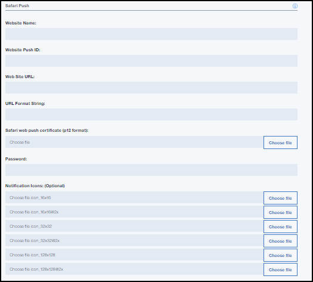

---

copyright:
 years: 2015, 2017

---

{:new_window: target="_blank"}
{:shortdesc: .shortdesc}
{:screen:.screen}
{:codeblock:.codeblock}

# 配置通知提供者凭证
{: #create-push-credentials}
上次更新时间：2017 年 4 月 12 日
{: .last-updated}

要设置 {{site.data.keyword.mobilepushshort}} 服务，从推送通知提供程序获取移动设备所需的凭证 - Firebase 云消息传递 (FCM) 或 Apple Push Notification 服务 (APNs)。 

您可以使用 **IBM Bluemix Services** 仪表板或使用 [REST API ](https://mobile.{DomainName}/imfpush/){: new_window} 来设置 {{site.data.keyword.mobilepushshort}}。

## 为 FCM 配置凭证
{: #create-push-enable-gcm}

Firebase 云消息传递 (FCM) 是用于向 Android 设备和 Google Chrome 传递推送通知的网关。FCM 是 Google 云消息传递 (GCM) 的新版本。要在仪表板上设置 {{site.data.keyword.mobilepushshort}} 服务，您需要获取 FCM 凭证。请确保您为新应用程序使用 FCM 配置。现有应用程序将继续以 GCM 配置运作。

### 获取发送方标识和 API 密钥
{: #android-senderid-apikey}

API 密钥以安全方式存储，并由 {{site.data.keyword.mobilepushshort}} 服务用于连接到 FCM 服务器，而发送方标识（项目编号）由客户机端的适用于 Google Chrome 和 Mozilla Firefox 的 Android SDK 和 JS SDK 使用。 

要设置 FCM，产生 API 密钥和发送方标识，请完成以下步骤：

1. 访问 [Firebase 控制台 ](https://console.firebase.google.com/?pli=1){: new_window}。
2. 选择**创建新项目**。 
3. 在“创建项目”窗口中，提供项目名称，选择国家/地区并单击**创建项目**。
3. 在导航窗格中，单击“设置”图标并选择**项目设置**。
4. 选择“云消息传递”选项卡，以生成服务器 API 密钥和发送方标识。

### 针对 Android 和 Chrome Apps and Extensions 设置 Push Notification 服务
{: #setup-push-android}

**注：**您将需要 FCM/GCM API 密钥和发送方标识（项目编号）。

1. 打开 Bluemix 仪表板，然后单击您创建的 {{site.data.keyword.mobilepushfull}} 服务实例，以打开仪表板。这将显示推送仪表板。要针对 Android 设置未绑定的 {{site.data.keyword.mobilepushshort}} 服务，请选择“未绑定 {{site.data.keyword.mobilepushshort}} 服务”图标，以打开 {{site.data.keyword.mobilepushshort}} 服务仪表板。 

2. 单击**设置 Push** 按钮，以为 Android 应用程序和 Google Chrome Apps and Extensions 配置 FCM/GCM 凭证。
3. 在**配置**页面上，对于 Android，转至**移动**选项卡，然后配置发送方标识（GCM 项目编号）和 API 密钥。对于 Google Chrome Apps and Extensions，转至 **Web** 选项卡，然后适当地配置发送方标识（FCM/GCM 项目编号）和 API 密钥。
4. 单击**保存**。
5. 后续步骤：[针对 Android 启用通知](c_enable_push.html)或[针对 Google Chrome Apps & Extensions 启用通知](c_web_extensions.html)。

## 为 APNs 配置凭证
{: #create-push-credentials-apns}

通过 Apple 推送通知服务 (APNs)，应用程序开发者可以将远程通知从 Bluemix 上的 {{site.data.keyword.mobilepushshort}} 服务实例（提供者）发送到 iOS 设备和应用程序。消息会发送到设备上的目标应用程序。 

您需要获取并配置您的 APNs 凭证。APNs 证书由 {{site.data.keyword.mobilepushshort}} 服务安全管理，在连接到 APNs 服务器（提供者）时需要使用该证书。

<!-- 1. Obtain an [Apple Developers ](https://developer.apple.com/){: new_window} account.-->

<!--2. [Register an App ID](#create-push-credentials-apns-register)
3. [Create a development and distribution APNs SSL certificate](#create-push-credentials-apns-ssl)
4. [Create a development provisioning profile](#create-push-credentials-dev-profile)
5. [Create a store distribution provisioning profile](#create-push-credentials-apns-distribute_profile)
6. [Creating .p12 push certificate file for Bluemix push](#create-p12-push-certificate-file-for-Bluemix-push)
7. [Set up APNs on the Push Dashboard](#create-push-credentials-apns-dashboard)
-->

### 注册应用程序标识
{: #create-push-credentials-apns-register}

应用程序标识（捆绑标识）是用于识别特定应用程序的唯一标识。每个应用程序都需要应用程序标识。像 {{site.data.keyword.mobilepushshort}} 服务这类的服务都是配置给应用程序标识的。

1. 请确保您具有 [Apple Developer ](https://developer.apple.com/){: new_window} 帐户。
2. 转至 [Apple Developer ](https://developer.apple.com){: new_window} 门户网站，单击 **Member Center**，然后选择 **Certificates, Identifiers & Profiles**。
3. 转至 [Apple Developer Library ](https://developer.apple.com/library/mac/documentation/IDEs/Conceptual/AppDistributionGuide/MaintainingProfiles/MaintainingProfiles.html#//apple_ref/doc/uid/TP40012582-CH30-SW991){: new_window} 中的 **Registering App IDs** 部分，然后遵循指示注册应用程序标识。

注册应用程序标识时，请选择以下选项：

* Push Notifications

* 显式标识后缀

4. 创建开发和分发 APNs SSL 证书。

### 创建开发和分发 APNs SSL 证书
{: #create-push-credentials-apns-ssl}

在获取 APNs 证书之前，必须首先生成一个证书签名请求 (CSR)，然后将其提交给 Apple（认证中心 (CA)）。CSR 中包含您公司的标识信息，以及您用于签署 Apple 推送通知的公用密钥和专用密钥信息。然后，在 iOS 开发者门户网站上生成 SSL 证书。该证书与其公用密钥和专用密钥一起存储在“钥匙串访问”中。

<!-- ###Before you begin -->
<!-- {: before-you-begin-certificate} -->

<!--[Register an App ID](#create-push-credentials-apns-register)-->

您可以在两种模式下使用 APN： 

* 用于开发和测试的沙箱模式。
* 在 App Store（或其他企业分发机制）中分发应用程序时的生产模式。

必须分别针对开发环境和分发环境获取证书。证书与接收远程通知的应用程序的应用程序标识相关联。对于生产方式，最多可创建两个证书。Bluemix 使用证书与 APNs 建立 SSL 连接。

<!-- Create a development and distribution SSL certificate. -->

1. 转至 [Apple Developer ](https://developer.apple.com){: new_window} 网站，单击 **Member Center**，然后选择 **Certificates, Identifiers & Profiles**。
2. 在 **Identifiers** 区域中，单击 **App IDs**。
3. 在您的应用程序标识列表中，选择您新创建的应用程序标识，然后选择 **Settings**。
4. 在 **Push Notifications** 区域中，创建开发 SSL 证书，然后创建生产 SSL 证书。

	 

5. 在 **About Creating a Certificate Signing Request (CSR) screen** 显示时，启用 Mac 上的**钥匙串访问**应用程序以创建证书签名请求 (CSR)。
6. 从菜单选择**钥匙串访问 > 证书助理 > 从证书颁发机构请求证书…** 
7. 在**证书信息**中，输入与您的 App Developer 帐户相关联的电子邮件地址和常用名称。提供有意义的名称来帮助您识别此为开发（沙箱）证书还是分发（生产）证书；例如，*sandbox_apns_certificate* 或 *production_apns_certificate*。
8. 选择**另存到磁盘**，以将 `.certSigningRequest` 文件下载到桌面，然后单击**继续**。
9. 在**另存为**菜单选项中，对 `.certSigningRequest` 文件命名并单击**保存**。
10. 单击**完成**。您现在就有一个 CSR 了。
11. 返回 **About Creating a Certificate Siging Request (CSR)** 窗口并单击 **Continue**。 
12. 在 **Generate** 屏幕中，单击 **Choose File...**，选择保存在桌面上的 CSR 文件。然后，单击 **Generate**。

13. 证书准备就绪后，单击 **Done**。
14. 在 **Push Notifications** 屏幕中，单击 **Download** 以下载证书，然后单击 **Done**。

15. 在 Mac 上，转至**钥匙串访问 > 我的证书**，然后找到新安装的证书。双击该证书，以将其安装到“钥匙串访问”中。
16. 选择证书和专用密钥，然后选择**导出**，以将证书转换成个人信息交换格式（`.p12` 格式）。

17. 在**存储为**字段中，为证书提供有意义的名称。例如，`sandbox_apns.p12_certifcate` 或 `production_apns.p12`，然后单击**保存**。

18. 在**输入密码**字段中，输入用于保护导出项的密码，然后单击**确定**。您可以使用此密码，在“推送”仪表板上配置 APNs 设置。
{: #step18}
	
19. **Key Access.app** 会提示您从**密钥串**屏幕导出密钥。输入 Mac 的管理员密码，以允许系统导出这些项，然后选择**总是允许**选项。这将在桌面上生成一个 `.p12` 证书。

### 创建开发供应概要文件
{: #create-push-credentials-dev-profile}

供应概要文件与应用程序标识一起来确定哪些设备可以安装并运行您的应用程序，以及您的应用程序可以访问哪些服务。对于每个应用程序标识，都可创建两个供应概要文件：一个用于开发，另一个用于分发。Xcode 使用开发供应概要文件来确定允许哪些开发者构建应用程序，以及允许哪些设备在应用程序上进行测试。

请确保您已执行以下操作：注册应用程序标识，针对 {{site.data.keyword.mobilepushshort}} Service 启用该标识，然后将其配置为使用开发和生产 APNs SSL 证书。

创建开发供应概要文件，如下所示：

1. 转至 [Apple Developer ](https://developer.apple.com){: new_window} 门户网站，单击 **Member Center**，然后选择 **Certificates, Identifiers & Profiles**。
2. 转至 [Mac Developer Library ](https://developer.apple.com/library/mac/documentation/IDEs/Conceptual/AppDistributionGuide/MaintainingProfiles/MaintainingProfiles.html#//apple_ref/doc/uid/TP40012582-CH30-SW62site){: new_window}，滚动至 **Creating Development Provisioning Profiles** 部分，然后遵循指示创建开发概要文件。
**注**：配置开发供应概要文件时，请选择以下选项：
	* **iOS App Development**
	* **对于 iOS 和 watchOS 应用程序**

### 创建应用商店分发供应概要文件
{: #create-push-credentials-apns-distribute_profile}

使用应用商店供应概要文件可提交应用程序以分发到 App Store。

1. 转至 [Apple Developer ](https://developer.apple.com){: new_window} 门户网站，单击 **Member Center**，然后选择 **Certificates, Identifiers & Profiles**。
2. 双击所下载的供应概要文件，以将其安装到 Xcode 中。

### 在推送通知仪表板上设置 APNs
{: #create-push-credentials-apns-dashboard}

要使用 {{site.data.keyword.mobilepushshort}} 服务发送通知，请上传 Apple 推送通知服务 (APNs) 所需的 SSL 证书。此外，也可以使用 REST API 来上传 APNs 证书。

<!-- Get your development and production APNs SSL certificate and the password associated with each type of certificate. For information, see Creating and configuring push credentials for APNs.-->

APNs 所需的证书为 `.p12` 证书。这些证书包含构建和发布应用程序所需的专用密钥和 SSL 证书。您必须从 Apple Developer Web 站点的 Member Center 生成证书（此操作需要有效的 Apple Developer 帐户）。对于开发（沙箱）环境和生产（分发）环境，需要不同的证书。

**注**：当 `.cer` 文件出现在钥匙串访问中之后，请将其导出到您的计算机，以创建 `.p12` 证书。

有关使用 APNs 的更多信息，请参阅 [iOS Developer Library: Local and Push Notification Programming Guide ](https://developer.apple.com/library/ios/documentation/NetworkingInternet/Conceptual/RemoteNotificationsPG/Chapters/ProvisioningDevelopment.html#//apple_ref/doc/uid/TP40008194-CH104-SW4){: new_window}。

要在“推送通知”服务仪表板上设置 APNs，请完成以下步骤：

1. 在“推送通知”服务仪表板上选择**配置**。
2. 选择**移动**选项，以更新 **APNs 推送凭证**表单上的信息。
3. 根据需要选择**沙箱**（开发）或**生产**（分发），然后上传在先前[步骤](#step18)中创建的 `p.12` 证书。

3. 在**密码**字段中，输入与 `.p12` 证书文件相关联的密码，然后单击**保存**。

使用有效的密码成功上传证书后，即可开始发送通知。

## 配置 Web 浏览器的凭证
{: #configure-credential-for-browsers}

IBM {{site.data.keyword.mobilepushshort}} 服务现已扩展了功能，可以向浏览器发送通知。 

{{site.data.keyword.mobilepushshort}} 服务需要 Web 站点 URL 或 Web 站点的域名来识别需要允许的请求。{{site.data.keyword.mobilepushshort}} 服务实例一次仅支持一个域名。因此，确保针对 Chrome、Firefox 和 Safari 设置相同的值。 

Chrome 和 Safari 浏览器需要针对 Web 推送进行额外的配置。您需要 FCM API 密钥，因为 FCM 端点用于在 Chrome 中传递消息。 

### 针对 Chrome 和 Firefox Web 推送进行配置 
{: #config-chrome-firefox}

1. 在“推送仪表板”面板上，选择**配置**。
2. 选择 Web 选项卡。
3. 配置 FCM/GCM API 密钥和将注册以接收推送通知的 Web 站点的 URL。
4. 单击**保存**。
5. 后续步骤：[为 Google Chrome 和 Mozilla Firefox 浏览器启用通知](c_chrome_firefox_enable.html)。

### 针对 Safari Web 推送进行配置 
{: #configure-safari}

在 Safari 上受支持的 {{site.data.keyword.mobilepushshort}} 服务是 10.0。您需要通过 Apple Developer 帐户生成证书，然后才能配置浏览器来接收通知。

#### 生成证书
{: #certificate-generation}

确保您已拥有 Apple Developer 帐户。您需要注册 Web 站点推送标识，并生成证书，以配置您的 Safari 浏览器来接收通知。以下步骤将帮助您开始使用该功能。

1. 在 Apple Developer Member 中心，单击 **Certificates, ID & Profiles**。 
2. 单击 **Identifiers**，然后单击 **Website Push IDs**。
3. 通过选择加号图标来创建新条目。

4. 在 Register Website Push ID 面板中，提供相应的 Web 站点推送标识描述和识别标识。建议使用反向域名格式，以 `web` 开头。例如：`web.com.example.dailyweatherreports`。
5. 注册 Web 站点推送标识。您现在已有 Web 站点推送标识 
6. 选择**编辑**以创建要用于 Web 站点推送标识的证书。
7. 在证书信息的“证书助理”窗口中，提供您的电子邮件标识和通用名称。将认证中心电子邮件地址保留为空白。
8. 单击**保存到磁盘**并选择**继续**。
9. 选择将证书保存到相应的文件夹。
10. 向导中提示时选择在磁盘上创建的 `.certSigningRequest`，以生成证书。请确保您已下载以 `.cer` 格式创建的 Web 站点推送证书。
11. 在“钥匙串访问”工具中打开证书。右键单击并导出为 p12 证书。记下在生成 p12 证书时提供的密码。

#### 为通知配置
{: #configuration-notification}
 
生成证书之后，您可以配置服务以将通知发送到 Safari。 

完成以下步骤：

1. 在 Push Notifications 服务仪表板中，单击**配置**。 
2. 选择 Web 选项卡。 
3. 在“Safari 推送”部分中，使用必要信息更新表单。 
	- **Web 站点名称**：这是您在通知中心中提供的名称。
	- **Web 站点推送标识**：使用 Web 站点推送标识的反向域字符串进行更新。例如，web.com.example.www。
	- **Web 站点 URL**：提供应该预订到推送通知的 Web 站点 URL。例如，https://www.example.com。
	- **允许的域**：这是可选参数。这是需要用户提供许可权的 Web 站点列表。请确保 URL 是以逗号分隔的值。请注意，如果未提供此列表，那么将使用 Web 站点 URL 中的值。 
	- **URL 格式字符串**：单击通知时解析的 URL。例如，["https://www.example.com"]。请确保 URL 使用 http 或 https 方案。
	- **Safari Web 推送证书**：上传 .p12 证书并提供密码。
4. 单击**保存**。	

	

现在，您已配置为将推送通知发送到 Safari 浏览器。
