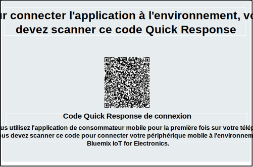
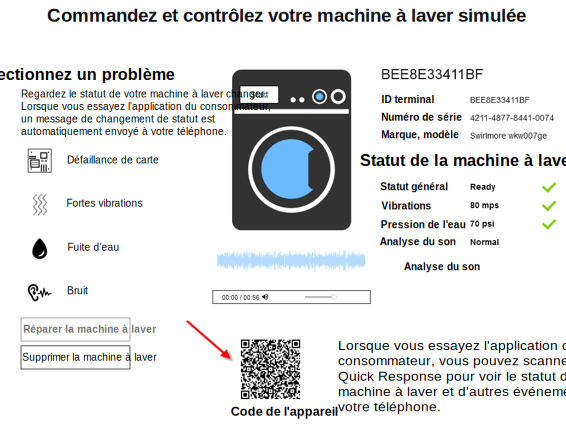

---

copyright:
  years: 2016, 2017
lastupdated: "2017-03-15"
---

<!-- Common attributes used in the template are defined as follows: -->
{:new_window: target="\_blank"}
{:shortdesc: .shortdesc}
{:screen: .screen}
{:codeblock: .codeblock}
{:pre: .pre}

# Utilisation de l'application mobile
{: #iot4e_using_mobile}

Familiarisez-vous avec l'application mobile {{site.data.keyword.iotelectronics_full}} pour découvrir comment vous pouvez recevoir des alertes, envoyer des commandes et vérifier le statut de vos appareils connectés à l'aide de votre périphérique mobile, comme votre smartphone ou votre tablette.
{:shortdesc}

Pour pouvoir utiliser l'application mobile, vous devez déployer une instance du module de démarrage {{site.data.keyword.iotelectronics}} dans votre organisation {{site.data.keyword.Bluemix_notm}}. Cette opération entraîne le déploiement automatique des services et des applications de composant du module de démarrage.

Pour vous initier à l'application mobile, effectuez les tâches suivantes :
1. [Téléchargez l'application mobile](#iot4e_downloadmobile) sur votre périphérique mobile.
2. [Connectez l'application mobile à l'environnement {{site.data.keyword.iotelectronics}}](#iot4e_connecting_mobile) et enregistrez vos appareils.

## Téléchargement de l'application mobile
{: #iot4e_downloadmobile}
Vous pouvez vous procurer l'application mobile pour les périphériques mobiles iOS ou Android.
- **Périphériques iOS** - Téléchargez l'application depuis l'App Store d'Apple.  Sur votre périphérique mobile, ouvrez le magasin Google Play et recherchez "ibm iot". Sélectionnez **IBM IoT for Electronics** et installez l'application.  Vous pouvez aussi l'installer sur votre périphérique mobile via [iTunes](https://itunes.apple.com/us/app/ibm-iot-for-electronics/id1103404928?ls=1&mt=8).
- **Périphériques Android** - Téléchargez l'application depuis le magasin Google Play. Sur votre périphérique mobile, ouvrez le magasin Google Play et recherchez "ibm iot". Sélectionnez **IBM IoT for Electronics** et installez l'application.

## Connexion de l'application mobile
{: #iot4e_connecting_mobile}

Pour connecter l'application mobile à votre environnement et enregistrer vos appareils, procédez comme suit :

1. Ouvrez votre application de démarrage {{site.data.keyword.iotelectronics}}. Pour des instructions, voir [Ouverture de l'application de démarrage](iot4ecreatingappliances.html#iot4e_openAppMain).

2. Sélectionnez **Contrôlez à distance vos appareils connectés**.

    

3. Créez une ou plusieurs machines à laver en faisant défiler la page jusqu'à la section intitulée **Ensuite, choisissez ou ajoutez une nouvelle machine à laver simulée**, puis cliquez sur l'icône +. Une machine à laver est créée.

    

4.	Faites défiler l'écran jusqu'au code Quick Response de connexion et scannez-le à l'aide de votre périphérique mobile. Le code Quick Response de connexion se trouve dans la section intitulée **Pour connecter l'application à l'environnement, vous devez scanner ce code Quick Response**.

  

5. Sur votre périphérique mobile, entrez vos données d'identification. Votre ID utilisateur et votre mot de passe ne sont pas limités en longueur. Mémorisez vos données d'identification pour les sessions ultérieures. A présent, votre périphérique mobile est enregistré dans votre environnement {{site.data.keyword.iotelectronics}}, et vous pouvez enregistrer des appareils individuels.

6. Sur votre ordinateur, accédez à une machine à laver simulée et cliquez dessus pour afficher ses données et son code Quick Response d'appareil.

  

7.	Utilisez votre périphérique mobile pour scanner le code Quick Response de la machine à laver. A présent, la machine à laver est enregistrée et son statut apparaît sur votre périphérique mobile.

**Etapes suivantes** Désormais, vous pouvez afficher des alertes et contrôler la machine à laver avec votre périphérique mobile. Essayez comme suit :
  - Sur votre ordinateur, sélectionnez un problème lié à la machine à laver, par exemple, Défaillance de carte ou Fortes vibrations. Le problème envoie une alerte à votre périphérique mobile.
  - Sur votre périphérique mobile, cliquez sur l'option de **lancement d'une lessive** pour démarrer la machine. Le statut de la machine à laver change sur votre ordinateur et passe par tous les cycles de lavage.
