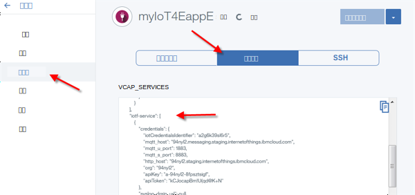
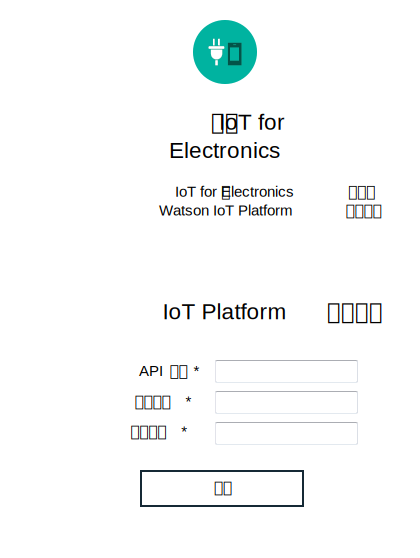

---

copyright:
  years: 2016, 2017
lastupdated: "2017-03-15"
---

<!-- Common attributes used in the template are defined as follows: -->
{:new_window: target="\_blank"}
{:shortdesc: .shortdesc}
{:screen: .screen}
{:codeblock: .codeblock}
{:pre: .pre}

# 管理数据和设备
{: #iot4e_dashboard}
从已注册的设备查看数据，并在具有 {{site.data.keyword.iotelectronics}} 仪表板的 {{site.data.keyword.iot_full}} 上管理设备和用户。
{:shortdesc}

使用 {{site.data.keyword.iotelectronics}} 仪表板来
- 查看组织中注册的设备
- 将用户映射到设备
- 执行批量操作，如添加和删除大量设备
- 抽取设备数据

## 打开仪表板
{: #iot4e_opendashboard}

**重要信息：**第一次使用仪表板之前，您必须先[启用仪表板](#iot4e_enabledashboard)。

要打开仪表板
1. 打开 {{site.data.keyword.Bluemix_notm}} 仪表板并单击 {{site.data.keyword.iot_short_notm}} 服务的名称。  

    **提示：**服务名称以 `iotf-service` 结尾，在“服务提供”列中描述为 *Internet of Things Platform*。
2. 在“欢迎”页面上，单击**启动**。
3. 在菜单上，选择 **Electronics**。

## 启用仪表板
{: #iot4e_enabledashboard}

通过执行以下步骤，在 {{site.data.keyword.iot_full}} 中启用 {{site.data.keyword.iotelectronics}} 仪表板。

  **注：**开始之前，您必须在 {{site.data.keyword.Bluemix_notm}} 组织中部署 {{site.data.keyword.iotelectronics}} Starter 的实例。部署入门模板的实例会自动部署组件应用程序和服务，包括 {{site.data.keyword.iot_short_notm}}。

1. 将新的角色添加到 {{site.data.keyword.iot_short_notm}} API 密钥。
  1. 打开 {{site.data.keyword.Bluemix_notm}} 仪表板并单击 {{site.data.keyword.iot_short_notm}} 服务的名称。  

    **提示：**服务名称以 `iotf-service` 结尾，在“服务提供”列中描述为 *Internet of Things Platform*。
  2. 在“欢迎”页面上，单击**启动**。
  3. 在菜单上，选择**应用程序** ，然后单击 API 密钥旁边的 。
  4. 单击**添加其他角色**并选择**操作应用程序**。
  5. 单击**保存**。

    

2. 找到 {{site.data.keyword.iot_short_notm}} 组织标识、API 密钥和认证代码。
  1. 返回到 {{site.data.keyword.Bluemix_notm}} 仪表板。
  2. 打开 {{site.data.keyword.iotelectronics}} 应用程序。

    **提示：**应用程序位于 {{site.data.keyword.Bluemix_notm}} 仪表板的“应用程序”部分。请确保单击名称而不是路径。
  3. 通过单击**运行时**然后选择**环境变量**以显示环境变量。
  4. 滚动到标签为 `iotf-service` 的部分。复制以下值。在下一步中需要这些值。

    - `org` - {{site.data.keyword.iot_short_notm}} 组织标识
    - `apiKey` - {{site.data.keyword.iot_short_notm}} API 密钥
    - `apiToken` - {{site.data.keyword.iot_short_notm}} 认证令牌  

    

3. 在 {{site.data.keyword.iotelectronics}} 服务中输入 {{site.data.keyword.iot_short_notm}} 凭证。

  1. 返回到 {{site.data.keyword.Bluemix_notm}} 仪表板。
  2. 通过单击 {{site.data.keyword.iotelectronics}} 服务名称打开该服务。

    **提示：**服务名称以 `ibmiotforelectronics` 结尾，在“服务提供”列中描述为 *IoT for Electronics*。
  3. 在“欢迎”页面上，输入在上一步中找到的 API 密钥、认证令牌和组织标识。
  4. 单击**更新**以保存条目。

    

4. 现在，您可以在 {{site.data.keyword.iot_short_notm}} 中[打开 {{site.data.keyword.iotelectronics}} 仪表板](#iot4e_opendashboard)。
